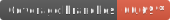
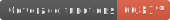
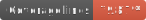

<p align="center">
  
</p>

<h1 align="center">Clean UI</h1>

[](https://github.com/semantic-release/semantic-release)
[](http://commitizen.github.io/cz-cli/)





---

- [Introduction](#introduction)
- [Storybook](#storybook)
- [Getting Started](#getting-started)
  - [Install and Consume](#install-and-consume)
  - [Customizing the theme](#customizing-the-theme)
  - [Using a component](#using-a-component)

## Introduction

Clean UI is a custom React JS component library built using
[theme-ui](https://github.com/system-ui/theme-ui)
and [typescript](https://www.typescriptlang.org/).
The aim of this library is to create a catalogue of
plug and play components that are clean and functional
so that they can be used in a wide variety of situations.

## Storybook

A [storybook](https://storybook.js.org/) of this component library
is published on [Chromatic](chromatic.com/). You can view it
[here](https://master--60751defa4d2780021f0bf50.chromatic.com).

## Getting Started

### Install and Consume

Install the package using either `npm` or `yarn`

```bash
# npm
npm install @draekien/clean-ui

# yarn
yarn add @draekien/clean-ui
```

To consume CleanUi, you must import the `CleanUi` component and wrap your
app in this component.

```tsx
// index.{tsx,jsx}
import { CleanUi } from 'clean-ui';

function Main() {
  return (
    <CleanUi>
      <App />
    </CleanUi>
  );
}

ReactDOM.render(<Main />, document.getElementById('root'));
```

### Customizing the theme

All it takes to use your own theme is to pass in a theme object to the
CleanUi `theme` prop. The theme passed in will be merged with the default
theme provided with Clean UI.

```tsx
// index.{tsx,jsx}
import { CleanUi, Theme } from 'clean-ui';

const myCustomTheme: Theme = {
  colors: {
    'p-400': 'purple',
  },
};

function Main() {
  return (
    <CleanUi theme={myCustomTheme}>
      <App />
    </CleanUi>
  );
}

ReactDOM.render(<Main />, document.getElementById('root'));
```

### Using a component

All components are exported from the main module. This means you can import
compoments using object destructuring like below.

```tsx
import React from 'react';
import { Button } from 'clean-ui';

const MyComponent: React.FC = () => {
  const handleClick = () => console.log('click!');

  return (
    <div>
      <Button onClick={handleClick}>Click me!</Button>
    </div>
  );
};
```
